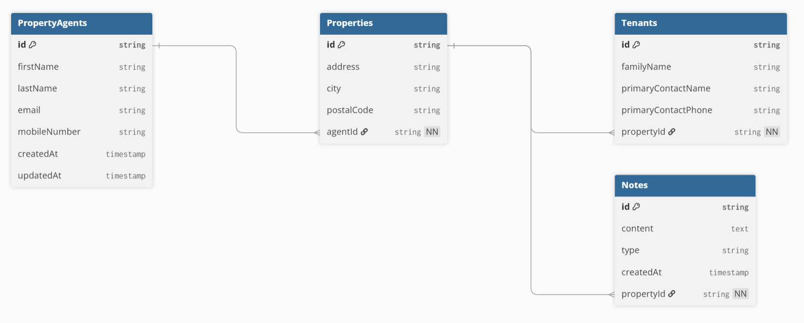

# Property Agent Management System

This is a full-stack application built with Vue.js (frontend) and Node.js/Express (backend) using TypeScript. It allows for the management of property agents via a REST API and a web client.

## Table of Contents
- [Project Overview](#project-overview)
- [Data Model](#data-model)
- [Features](#features)
- [Tech Stack](#tech-stack)
- [Setup and Installation](#setup-and-installation)
  - [Prerequisites](#prerequisites)
  - [Backend Server Setup](#backend-server-setup)
  - [Frontend Client Setup](#frontend-client-setup)
- [API Usage (Postman / cURL)](#api-usage-postman--curl)
  - [1. Get All Agents](#1-get-all-agents)
  - [2. Get a Single Agent](#2-get-a-single-agent)
  - [3. Create a New Agent](#3-create-a-new-agent)
  - [4. Update an Agent](#4-update-an-agent)
  - [5. Delete an Agent](#5-delete-an-agent)
- [Stretch Goal Discussion](#stretch-goal-discussion)

## Project Overview

This application consists of two main parts:
1.  **Backend REST API**: A Node.js/Express server that manages `PropertyAgent` data in memory. It provides full CRUD (Create, Read, Update, Delete) functionality.
2.  **Frontend Web Client**: A Vue.js single-page application that provides a user interface for creating new property agents.

## Data Model

The application uses a relational data model to represent the relationships between agents, properties, tenants, and notes.


- **PropertyAgents**: Stores agent information.
- **Properties**: Each property is managed by one agent.
- **Tenants**: Each property can have multiple tenants from a single family.
- **Notes**: An agent can create notes for a specific property.

## Features

- **Backend API (TypeScript/Express)**
  - Full CRUD endpoints for `PropertyAgent`.
  - In-memory data store (no database required).
  - Robust server-side validation using `zod`.
  - Automatic `createdAt` and `updatedAt` timestamps.
- **Frontend Client (TypeScript/Vue)**
  - A responsive, modern UI for creating new property agents.
  - Client-side form with clear success and error handling.
  - Custom styling inspired by the Vue.js color palette.

## Tech Stack

- **Backend**: Node.js, Express.js, TypeScript, Zod (for validation)
- **Frontend**: Vue 3, Vite, TypeScript, Axios
- **Development**: `ts-node-dev` for live reloading on the backend.

---

## Setup and Installation

### Prerequisites
- [Node.js](https://nodejs.org/) (v18.x or later recommended)
- [npm](https://www.npmjs.com/) (usually included with Node.js)

### Backend Server Setup

1.  **Navigate to the server directory:**
    ```bash
    cd server
    ```

2.  **Install dependencies:**
    ```bash
    npm install
    ```

3.  **Run the development server:**
    ```bash
    npm run dev
    ```
    The API will be running at `http://localhost:3000`. The server will automatically restart when you make changes to the code.

### Frontend Client Setup

1.  **Open a new terminal window.**

2.  **Navigate to the client directory from the project root:**
    ```bash
    cd client
    ```

3.  **Install dependencies:**
    ```bash
    npm install
    ```

4.  **Run the development server:**
    ```bash
    npm run dev
    ```
    The web application will be available at `http://localhost:5173` (or another port if 5173 is busy).

---

## API Usage (Postman / cURL)

All API endpoints are prefixed with `http://localhost:3000`.

### 1. Get All Agents
- **Method**: `GET`
- **URL**: `/agents`
- **cURL**: `curl http://localhost:3000/agents`

### 2. Get a Single Agent
- **Method**: `GET`
- **URL**: `/agents/:id`
- **cURL**: `curl http://localhost:3000/agents/your-agent-id`

### 3. Create a New Agent
- **Method**: `POST`
- **URL**: `/agents`
- **Headers**: `Content-Type: application/json`
- **Body (raw JSON)**:
  ```json
  {
    "firstName": "Jhonny",
    "lastName": "Bravo",
    "email": "jhonny.bravo@gmail.com",
    "mobileNumber": "123-456-7890"
  }

### 4. Update an Agent

-   **Method**: `PUT`
-   **URL**: `http://localhost:3000/agents/:id`
-   **Body** (raw JSON, only include fields to update):
    ```json
    {
        "mobileNumber": "111-222-3333"
    }
    ```
-   **cURL**:
    ```bash
    curl -X PUT -H "Content-Type: application/json" -d '{"mobileNumber":"111-222-3333"}' http://localhost:3000/agents/your-agent-id
    ```

### 5. Delete an Agent

-   **Method**: `DELETE`
-   **URL**: `http://localhost:3000/agents/:id`
-   **cURL**: `curl -X DELETE http://localhost:3000/agents/your-agent-id`

---

## Stretch Goal Implementation

**Identified Improvement**: Robust Server-Side Input Validation.

**Reasoning**: While the client can provide basic validation (e.g., `required` fields), an application should never trust the client. The backend must be the ultimate authority on data integrity. Without server-side validation, malicious or malformed requests could corrupt the data store or cause unexpected crashes.

**Implementation**: I have integrated the `zod` library to create strongly-typed schemas for both creating and updating agents. This ensures that:
-   All required fields are present on creation.
-   Data types are correct (e.g., `email` is a valid email format).
-   The API returns clear, specific error messages detailing which fields failed validation, allowing the frontend to provide a better user experience.

This makes the API more secure, resilient, and easier to debug.